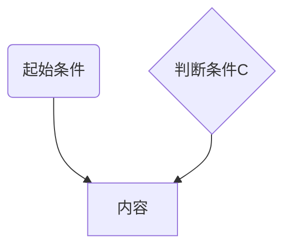

# 这是一级标题（记得一定要有空格）
## 这是二级标题 以此类推
回车+分割线

---

*这是斜体* 
**这是粗体**
~~这是删除线~~  
<u>文本的下划线不太一样</u>  
_另外_
__下划线符号一样表示文本类型__  
==高亮文字==  
上标X^2^  下标H~2~0
---

>这是引用
>>这是二级引用

---
* 列表1 无序列表
  * 列表1.1
    * 列表1.1.1
+ 列表2 ‘+’ 一样
- 列表3 ‘-’ 一样

1. 第一点 有序列表
2. 第二点

-[x] 带勾复选框
-[ ] 一级未完成
  -[ ] 二级未完成

这是超链接[baidu](http://www.baidu.com)  
[这也是百度][id]

[id]:http://www.baidu.com  

标题跳转 比如[点此跳转](#这是二级标题-以此类推)

这是一个脚注[^脚注]  
[^脚注]:点击跳转这里

---
$f(x)=ax^2+bx_1+c_2 $ 一个$靠左
$$+\Delta + \sqrt{a+b} $$两个美元符号居中

---
代码行显示-英式`````，加上代码类别
```python
def fun():
    print('这是python类型代码块')
```



---
| 姓名    |    年龄 | 职业 |
|:------|------:|:--:|
| 冒号左对齐 | 冒号右对齐 | 居中 |
| 张三    |    23 | 学生 |
| -     |     - | -  |
| 李四    |    50 | 老师 |

---

这是图片


  